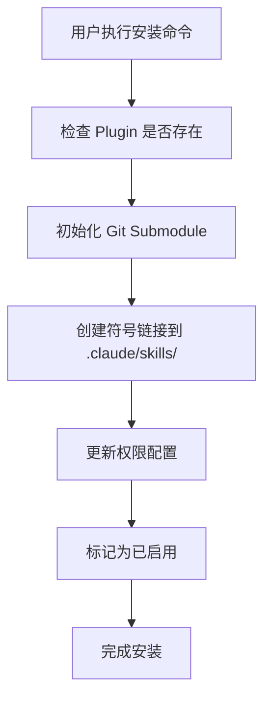

# Claude Code Plugin Marketplace

一个精选的 Claude Code Plugins 集合，通过 Git Submodule 方式管理，提供简单的命令行安装和管理功能。

## 特性

- 🚀 **简单安装**: 通过 `/plugin install` 命令一键安装 plugins
- 📦 **Git Submodule 管理**: 保持 plugins 独立更新，支持版本控制
- 🔧 **自动配置**: 自动更新权限和链接配置
- 📋 **插件管理**: 列出、安装、卸载 plugins
- 🎯 **可扩展**: 易于添加新的 plugins

## 快速开始

### 1. 克隆仓库

```bash
git clone https://github.com/FineKe/rust-marketplace.git
cd rust-marketplace
```

### 2. 初始化 Submodules

```bash
git submodule update --init --recursive
```

### 3. 查看可用的 Plugins

```bash
./scripts/list-plugins.sh
```

输出示例：
```
========================================
  Claude Code Plugin Marketplace
========================================

[1] Rust Skills
    ID: rust-skills
    Version: main
    Author: ZhangHanDong
    Status: ○ Available
    Description: Rust 开发的三层认知框架和技能集...
```

### 4. 安装 Plugin

```bash
./scripts/install-plugin.sh rust-skills
```

或者在 Claude Code 中使用：
```
/plugin install rust-skills
```

### 5. 重启 Claude Code

安装完成后，重启 Claude Code 以加载新的 skills。

## 使用 /plugin 命令

在 Claude Code 中，你可以使用以下命令：

### 列出所有 Plugins
```
/plugin list              # 显示所有 plugins
/plugin list --installed  # 只显示已安装的
/plugin list --available  # 只显示未安装的
```

### 安装 Plugin
```
/plugin install rust-skills
```

### 查看 Plugin 信息
```
/plugin info rust-skills
```

### 卸载 Plugin
```
/plugin uninstall rust-skills
```

## 可用的 Plugins

### Rust Skills

**ID**: `rust-skills`  
**作者**: ZhangHanDong  
**仓库**: https://github.com/ZhangHanDong/rust-skills

#### 描述
Rust 开发的三层认知框架和技能集，提供：
- **Layer 1**: 语言机制（所有权、生命周期、错误处理等）
- **Layer 2**: 设计模式、性能优化、生态集成
- **Layer 3**: 领域特定约束（FinTech、ML、IoT 等）

#### 特性
- ✅ 400+ 关键词触发器
- ✅ 动态 Crate 技能生成
- ✅ 后台 Agent 支持
- ✅ 自动 Hook 机制
- ✅ 多层认知路由

#### 使用示例
```rust
// 在 Claude Code 中开发 Rust 项目时
// 系统会自动触发相关的认知框架

// 使用 /sync-crate-skills 同步 Cargo.toml 依赖
/sync-crate-skills

// 遇到所有权问题时，会自动触发 Layer 1 机制
// 遇到设计问题时，会触发 Layer 2 模式
// 遇到领域特定问题时，会触发 Layer 3 约束
```

## 项目结构

```
rust-marketplace/
├── .claude/
│   ├── settings.local.json          # Claude 权限配置
│   └── skills/
│       └── marketplace/
│           └── plugin.md             # /plugin 命令定义
├── .claude-plugin/
│   └── marketplace.json              # Marketplace 元数据
├── plugins/                          # Git Submodules
│   └── rust-skills/                  # Rust Skills Plugin
├── scripts/
│   ├── install-plugin.sh             # 安装脚本
│   ├── link-plugin.sh                # 链接脚本
│   └── list-plugins.sh               # 列表脚本
├── marketplace.yaml                  # Marketplace 配置
├── .gitmodules                       # Git Submodule 配置
└── README.md
```

## 架构设计

### Git Submodule 方式

使用 Git Submodule 管理 plugins 的优势：

1. **独立更新**: 每个 plugin 可以独立更新版本
2. **版本控制**: 可以固定特定的 commit 或 tag
3. **轻量级**: 不需要复制整个 plugin 代码
4. **同步更新**: 通过 `git submodule update` 同步最新内容

### 安装流程



### 配置文件说明

#### marketplace.yaml

主配置文件，定义所有可用的 plugins：

```yaml
plugins:
  - id: rust-skills
    name: "Rust Skills"
    version: "main"
    source: plugins/rust-skills
    repository: https://github.com/ZhangHanDong/rust-skills
    requires_permissions:
      - mcp__acp__Bash
      - agent-browser
    enabled: false
```

#### .claude-plugin/marketplace.json

Marketplace 元数据，描述整个 marketplace：

```json
{
  "name": "Claude Code Plugin Marketplace",
  "version": "1.0.0",
  "skills": [
    {
      "name": "plugin",
      "commands": ["/plugin install", "/plugin list"]
    }
  ]
}
```

## 添加新的 Plugin

### 1. 添加 Git Submodule

```bash
git submodule add <plugin-git-url> plugins/<plugin-id>
```

### 2. 更新 marketplace.yaml

```yaml
plugins:
  - id: your-plugin
    name: "Your Plugin Name"
    version: "main"
    source: plugins/your-plugin
    repository: https://github.com/your/plugin
    description: |
      Plugin description here
    author: Your Name
    tags:
      - tag1
      - tag2
    requires_permissions:
      - mcp__acp__Bash
    install_path: .claude/skills/your-plugin
    enabled: false
```

### 3. 测试安装

```bash
./scripts/install-plugin.sh your-plugin
```

## 权限说明

Marketplace 需要以下权限：

- `mcp__acp__Bash`: 执行安装脚本
- `mcp__acp__Read`: 读取配置文件
- `mcp__acp__Write`: 更新配置文件

某些 plugins 可能需要额外权限：

- `agent-browser`: 后台 Agent 网络访问（rust-skills）

权限会在安装时自动添加到 `.claude/settings.local.json`。

## 脚本说明

### install-plugin.sh

完整的 plugin 安装流程：
1. 检查 plugin 是否存在
2. 初始化 git submodule
3. 创建符号链接
4. 更新权限配置
5. 标记为已启用

### list-plugins.sh

列出所有可用的 plugins，支持过滤：
- `--installed`: 只显示已安装
- `--available`: 只显示未安装

### link-plugin.sh

单独的链接操作，用于修复或重新链接：
```bash
./scripts/link-plugin.sh rust-skills
```

## 常见问题

### Q: 如何更新已安装的 plugin？

```bash
cd plugins/rust-skills
git pull origin main
cd ../..
```

或者使用：
```bash
git submodule update --remote plugins/rust-skills
```

### Q: 安装后 skills 没有生效？

确保已重启 Claude Code。新的 skills 需要重启才能加载。

### Q: 如何卸载 plugin？

```bash
rm -rf .claude/skills/rust-skills
# 在 marketplace.yaml 中设置 enabled: false
```

或使用命令：
```
/plugin uninstall rust-skills
```

### Q: Submodule 初始化失败？

确保你有访问 plugin 仓库的权限，检查 SSH key 或 HTTPS 认证。

### Q: 符号链接不工作？

在某些系统上可能需要管理员权限。可以修改 `marketplace.yaml` 中的 `default_install_method` 为 `copy`。

## 贡献

欢迎贡献新的 plugins！请：

1. Fork 此仓库
2. 添加你的 plugin 作为 submodule
3. 更新 marketplace.yaml
4. 提交 Pull Request

## 许可证

MIT License

## 致谢

- [Rust Skills](https://github.com/ZhangHanDong/rust-skills) by ZhangHanDong
- Claude Code by Anthropic

## 联系方式

- Issues: https://github.com/FineKe/rust-marketplace/issues
- Discussions: https://github.com/FineKe/rust-marketplace/discussions

---

**Made with ❤️ for the Claude Code community**
